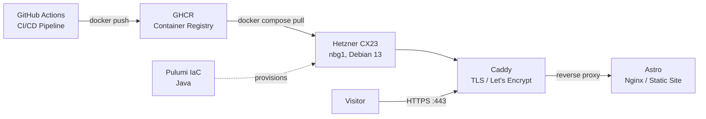

# trettstadt.de

Business website and blog built with [Astro](https://astro.build) using the [AstroNano](https://github.com/markhorn-dev/astro-nano) theme, served on a Hetzner cloud server via Docker and Caddy.

## Architecture



## Project Structure

| Directory | Purpose |
|---|---|
| `astro-site/` | Astro website source code (AstroNano theme) |
| `docker/` | Docker Compose & Caddyfile for production |
| `infrastructure/` | Pulumi (Java/Gradle) for Hetzner provisioning |
| `.github/workflows/` | CI/CD pipeline |

## Tech Stack

- **Frontend:** Astro 5, Tailwind CSS, TypeScript
- **Infrastructure:** Pulumi (Java) + Hetzner Cloud
- **Server:** Docker Compose, Caddy (auto TLS)
- **CI/CD:** GitHub Actions → GHCR → SSH deploy

## Development

```bash
cd astro-site
npm install
npm run dev
```

## Deployment

Push to `main` triggers the GitHub Actions pipeline:

1. Builds the Astro site as a Docker image
2. Pushes to `ghcr.io/trettstadt/portfolio-astro:latest`
3. SSH into the production server
4. Runs `docker compose pull && docker compose up -d`

## Infrastructure

The Hetzner server is provisioned via Pulumi:

```bash
cd infrastructure
pulumi up --stack prod-web
```

Requires `hcloud:token` and `webSshPublicKey` to be configured.

## License

MIT
