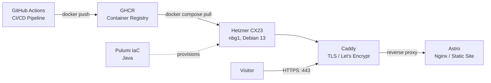

The goal was to build a fast and simple website that can basically deployed anywhere. I chose Astro because it builds a static site and there is no need for a database. Also all changes are versioned in Git.
Pushing to the repo builds a Docker image and triggers an update on the server. On the server we run the website container and a Caddy container as proxy that also handles TLS including getting certificates from Let's Encrypt. The server is a small Hetzner cloud server located in Germany. 